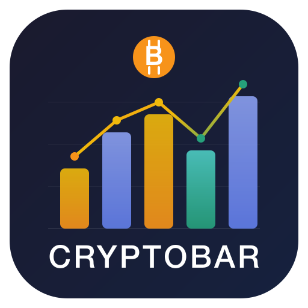
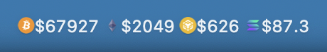
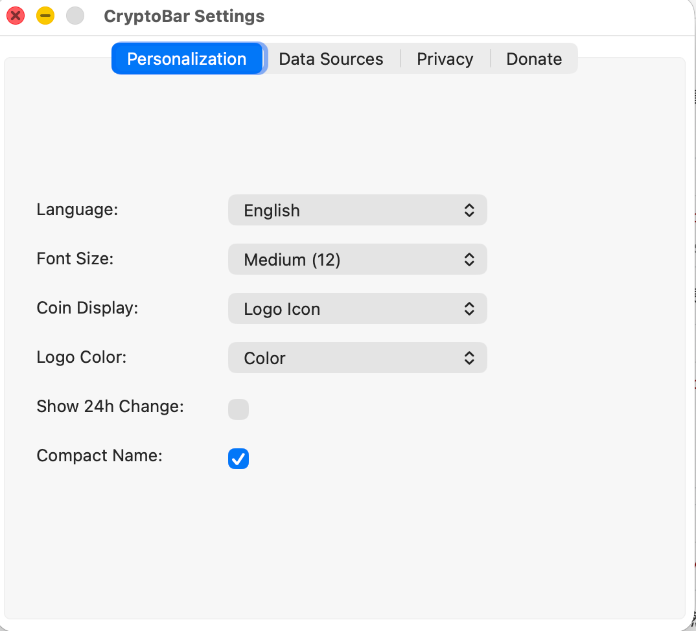

<p align="center">
  
</p>

<h1 align="center">CryptoBar</h1>

<p align="center">
  <b>Real-time cryptocurrency prices in your macOS menu bar</b>
</p>

<p align="center">
  <a href="README_CN.md">简体中文</a> · English
</p>

<p align="center">
  
  
  
  <a href="https://github.com/colin-nian/cryptobar/releases/latest"></a>
</p>

---

CryptoBar is a lightweight macOS menu bar application that displays real-time cryptocurrency prices. It supports multiple data sources, coin logo icons, and a native settings window — all running quietly in your menu bar.

<p align="center">
  
</p>

## Features

- **Real-time prices** — Live cryptocurrency prices via WebSocket streaming
- **Multiple data sources** — Binance, HTX (Huobi), Gate.io with one-click switching
- **Coin logos** — Display coin icons (color or grayscale) directly in the menu bar
- **24h change** — Optional 24-hour price change percentage display
- **Price alerts** — Set above/below price alerts with native macOS notifications
- **Native settings** — Multi-tab settings window (Personalization, Data Sources, Privacy, Donate)
- **i18n** — English, 简体中文, 繁體中文, 日本語, 한국어
- **Lightweight** — No Dock icon, runs entirely in the menu bar
- **Customizable** — Font size, display mode (logo/text/both), compact names

<p align="center">
  
</p>

## Quick Start

> **Download the latest release and start using it in seconds.**

1. **[Download CryptoBar.app](https://github.com/colin-nian/cryptobar/releases/latest)** — grab the `.zip` from the latest release
2. Unzip and drag `CryptoBar.app` into your `/Applications` folder
3. Launch it — CryptoBar will appear in your menu bar

> **First launch:** macOS may show a security warning for unsigned apps. Go to **System Settings → Privacy & Security** and click **Open Anyway**.

## Build from Source

**Requirements:** Go 1.23+, macOS 12+, Xcode Command Line Tools

```bash
git clone https://github.com/colin-nian/cryptobar.git
cd cryptobar
make app
```

The built application will be at `build/CryptoBar.app`.

Then install to Applications:

```bash
make install
```

## Usage

1. Launch `CryptoBar.app` — it appears in your menu bar
2. Click the menu bar item to see detailed prices
3. Click **Settings** to customize display, switch data sources, or change language
4. Click coin names to toggle their visibility in the menu bar
5. Use **Select Coins** to add or remove tracked cryptocurrencies

## Configuration

Settings are stored in `~/.cryptobar/config.json`. You can configure:

| Setting | Description |
|---------|-------------|
| Font Size | Small (10), Medium (12), Large (14) |
| Coin Display | Logo Icon, Text Symbol, Logo + Text |
| Logo Color | Color or Grayscale |
| Show 24h Change | Toggle price change percentage |
| Compact Name | Show only ticker symbol |
| Language | EN, 简中, 繁中, 日, 韩 |
| Data Source | Binance, HTX, Gate.io |

## Supported Exchanges

| Exchange | WebSocket | REST API | Status |
|----------|-----------|----------|--------|
| Binance | `wss://stream.binance.com` | `api.binance.com` | ✅ |
| HTX (Huobi) | `wss://api.huobi.pro/ws` | `api.huobi.pro` | ✅ |
| Gate.io | `wss://api.gateio.ws/ws/v4/` | `api.gateio.ws` | ✅ |

## Project Structure

```
.
├── main.go                     # Entry point
├── Makefile                    # Build & package
├── assets/                     # Icons, Info.plist
└── internal/
    ├── config/                 # Configuration management
    ├── datasource/             # Exchange API implementations
    │   ├── datasource.go       # Interface & factory
    │   ├── binance.go          # Binance WebSocket + REST
    │   ├── htx.go              # HTX WebSocket + REST
    │   └── gateio.go           # Gate.io WebSocket + REST
    ├── i18n/                   # Internationalization
    ├── menubar/                # Menu bar UI & settings bridge
    ├── menuet/                 # Forked menuet library (rich title support)
    ├── price/                  # Price data store
    └── alert/                  # Price alert manager
```

## Tech Stack

- **Go** — Core application logic
- **Objective-C / Cocoa** — Native macOS UI (NSWindow, NSTabView, NSStatusBar)
- **CGO** — Bridge between Go and native macOS APIs
- **WebSocket** — Real-time price streaming via gorilla/websocket
- **Core Image** — Grayscale logo rendering

## License

MIT License. See [LICENSE](LICENSE) for details.

## Feedback

If you encounter any issues or have feature requests, please [open an issue](https://github.com/colin-nian/cryptobar/issues) on GitHub.

## Donate

If you find CryptoBar useful, you can support the development:

**USDT (TRC20):** `TV75kwC1n7yA33kMi9yYw7EVgybPua4fvQ`

<p align="center">
  
</p>

> Please make sure to use the TRC20 network when sending USDT.
